# Bridgend Book Club Website

![Bridgend Book Club Website Mock-up] () <!--INSERT MOCK UP IMAGES AT THE END -->

#### **By Ffion Haf Edwards**

[Click here to view the live web application] () <!--INSERT LINK ONCE SITE IS DEPLOYED -->

#### **BRIDGEND BOOK CLUB**

This is the documentation for the fictional Bridgend Book Club's  website. It has been built using HTML5 & CCS3 for educational purposes as part of the Code Institute's Diploma in Web Application Development.

## Table of Contents

- [Bridgend Book Club Website](#bridgend-book-club-website)
      - [**By Ffion Haf Edwards**](#by-ffion-haf-edwards)
      - [**BRIDGEND BOOK CLUB**](#bridgend-book-club)
  - [Project Development \& Planning](#project-development--planning)
    - [Project Goals](#project-goals)
      - [**Project Purpose**](#project-purpose)
      - [**Client Background**](#client-background)
      - [**Client Goals**](#client-goals)
      - [**User Goals**](#user-goals)
    - [Research](#research)
      - [**Market Review**](#market-review)
      - [**Key Takeaways from Market Review**](#key-takeaways-from-market-review)
    - [User Stories](#user-stories)
      - [**User Story 1:**](#user-story-1)
      - [**User Story 2:**](#user-story-2)
      - [**User Story 3:**](#user-story-3)
    - [Design, Layout \& Structure](#design-layout--structure)
      - [**Wireframes**](#wireframes)
      - [**Structure**](#structure)
      - [**Colour**](#colour)
      - [**Fonts**](#fonts)
  - [Technologies Used](#technologies-used)
    - [Languages](#languages)
    - [Tools](#tools)
  - [Features](#features)
    - [Whole Site](#whole-site)
      - [**Nav Bar**](#nav-bar)
      - [**Hero**](#hero)
      - [**Footer**](#footer)
      - [**Favicon**](#favicon)
    - [Home Page](#home-page)
      - [**Bio \& Join Us Button**](#bio--join-us-button)
    - [About Us](#about-us)
      - [**About Us Sections**](#about-us-sections)
      - [**Call To Action**](#call-to-action)
    - [Book Club](#book-club)
      - [**Book Club Options**](#book-club-options)
    - [Join Us](#join-us)
      - [**Join Us Info \& Form**](#join-us-info--form)
    - [Other Pages](#other-pages)
      - [**Thankyou Page**](#thankyou-page)
      - [**404 Page**](#404-page)
    - [Future Features](#future-features)
  - [Testing \& Bugs](#testing--bugs)
    - [HTML Validation](#html-validation)
    - [CSS Validation](#css-validation)
    - [Accessibility](#accessibility)
    - [Performance](#performance)
    - [Responsiveness / Device Testing](#responsiveness--device-testing)
    - [Browser Compatibility](#browser-compatibility)
    - [Bugs \& Fixes](#bugs--fixes)
    - [Testing User Stories](#testing-user-stories)
  - [Deployment](#deployment)
  - [Credits](#credits)
    - [Code](#code)
    - [Content](#content)
    - [Media](#media)
    - [Acknowledgements](#acknowledgements)

## Project Development & Planning

I followed the principles of User Experience (UX) in the planning and development of my website, including the 5 planes of which are Strategy, Scope, Structure, Skeleton & Surface.

I wanted to ensure that the webaite was easy to use, responsive, accessible and intuitive. It was imperative that the website met the goals and needs of both the user and client.

### Project Goals

#### **Project Purpose**

The purpose of this project is to create a website for the *Bridgend Book Club*. The website will serve as a platform for members to find clubs tailored to their reading interest, as well as to discover upcoming events and meetings. The website will also provide information about the club, including its history, membership details and contact information.

The website will be designed to be user-friendly and accessible to all members of the club. It will be easy to navigate, with clear sections for different types of content.

Since all meetings and discussions are held in person, the website will not include any virtual meeting features. Instead, it will focus on providing information about upcoming events and meetings.

The website will be built using modern web development technologies, including HTML, CSS, and Bootstrap. It will be hosted on a reliable web server, ensuring that it is always available to members.

Overall, the goal of this project is to create a website that enhances the experience of being a member of the Bridgend Book Club. It is the ambition to foster a sense of community among members and encourage more people to join the club by providing an online platform.

#### **Client Background**

- The client is a passionate and well-established book club committee comprising avid readers of diverse literary genres.

- They have been meeting in person for years, fostering a strong sense of community and a shared love for reading.

- Due to changing circumstances, including the desire to expand their reach and accommodate virtual meetings, they've decided to create a digital presence through a website.

- The committee aims to use the website as a hub for book recommendations, event announcements.

- They want the website to reflect the club's values of inclusivity, intellectual growth, and a welcoming atmosphere for book enthusiasts of all backgrounds.

#### **Client Goals**

- Create a digital presence for the book club.
- Showcase diverse literary interests.
- Enable book recommendations.
- Announce club events through the website.
- Promote member engagement.
- Reflect inclusivity and a welcoming atmosphere in the website's design and content.

#### **User Goals**

- Discover new books and engage in discussions.
- Stay informed about club events and schedules.
- Connect with like-minded readers.
- Participate in both online and offline activities.
- Navigate the website intuitively.
- Feel welcome and included in the book club community.

### Research

#### **Market Review**

A market review of book club websites reveals a dynamic landscape shaped by the evolving preferences of avid readers. These websites have evolved into thriving digital communities where members seek not only book recommendations but also engaging discussions and events. The market highlights a growing demand for platforms that cater to diverse literary interests, with users seeking inclusivity and opportunities to connect with like-minded readers. The success of these websites hinges on their ability to provide intuitive navigation, personalized reading experiences, and a welcoming atmosphere. As book clubs continue to embrace the digital realm, the market review underscores the importance of user-centric design and robust features that foster meaningful interactions and support the shared passion for literature.

- [Goodreads Book Clubs](https://www.goodreads.com/group/show_tag/bookclub): Goodreads offers a platform for various book clubs where members can engage in discussions, discover new books, and connect with other readers.

- [Meetup Book Clubs](https://www.meetup.com/): Meetup.com hosts numerous book clubs, both virtual and in-person, that cater to different genres and reading preferences. Example: [book club nyc](https://www.meetup.com/book-club-nyc/).
  
- [Oprah's Book Club](https://www.oprah.com/app/books.html): Oprah's Book Club has a dedicated online presence with discussions, recommendations, and resources for its members.

- [Reddit Book Clubs](https://www.reddit.com/): Reddit has several active book club communities like r/bookclub where members discuss and vote on monthly book selections. Example: [r/bookclub](https://www.reddit.com/r/bookclub/)

- [CardiffRead](https://cardiffread.co.uk/): Local book club website in South Wales that features schedules, book lists and FAQs.

#### **Key Takeaways from Market Review**

- **Diverse Literary Interests:** The market for book club websites is characterized by a diverse range of literary interests and genres. Users are increasingly seeking platforms that cater to a wide array of reading preferences, reflecting the importance of inclusivity in the online book club community.

- **Community and Engagement:** Book club websites have evolved into thriving digital communities where members value not only book recommendations but also active engagement through discussions and events. Successful platforms foster meaningful interactions among members, creating a sense of belonging.

- **User-Centric Design:** The success of book club websites hinges on their ability to provide an intuitive and user-friendly design. Navigating the website should be easy, and content should be well-organized to enhance the overall user experience.

- **Personalization:** Users expect the ability to personalize their reading experience on these websites. This includes enabling the users to join book clubs based on individual preferences and goals, which enhances member satisfaction and engagement.

- **Digital Transition:** The market review highlights the ongoing shift of traditional book clubs into the digital realm. This transformation underscores the importance of technology in supporting book club activities, from virtual meetings to online discussions, enabling book clubs to expand their reach and impact.

These key takeaways illustrate the dynamic and evolving nature of the book club website market, emphasizing the importance of catering to diverse interests, fostering community engagement, and embracing user-centric design and personalization.

### User Stories

#### **Discovering New Books**

As a book club member user I want to easily discover new books and reading recommendations on the website so that I can expand my reading horizons and contribute to club discussions (online and offline).

Acceptance Criteria:

- I should be able to browse a curated list of recommended books on the homepage.
- Each book recommendation should include a title, cover image, and a brief summary.
- I should have the option to click on a book to see more details, including event details of the next book club meeting.

#### **Exploring Club Information:**

As a prospective book club member I want to easily find detailed information about the book club on the website so that I can learn about its mission, values, meeting format, and membership requirements before deciding to join.

Acceptance Criteria:

- The website should have a clear and prominently displayed "About Us" section accessible from the homepage.
- Within this section, I should find a concise but informative summary of the club's mission, goals, and values.
- I want to learn about the typical format of club meetings, including how often they occur and whether they are virtual or in-person.
- The website should outline any membership requirements or expectations, such as age restrictions, fees, or participation guidelines.
- I should be able to contact the club organizers or committee for additional inquiries or clarifications.

#### **Event Participation:**

As a book club member I want to stay informed about upcoming book club events, so that I can actively participate in discussions and meetings, whether they are in-person or online.

Acceptance Criteria:

- When I go on the website, I should see a "Club Events" section on the homepage or main navigation menu.
- The "Club Events" section should display a calendar or list of upcoming events, including details such as date, time, location (if in-person), and the book to be discussed.
- The website should provide options for filtering events based on date, genre, or format (in-person or online).
- For online events, there should be a clear link or integration with the virtual meeting platform (e.g., Zoom or Google Meet).

### Design, Layout & Structure

I chose to design a minimalist book club website, where the digital realm seamlessly marries the timeless charm of a paper book. At the heart of my design philosophy lies the desire to create an online space that evokes the sensory delight and simplicity of holding a well-loved book in your hands. Here's an overview of my design, layout, and structural principles:

#### **Wireframes**
<!-- Insert links here for HOME/ ABOUT/ BOOK CLUB/ JOIN US wireframes-->

#### **Structure**

The scope, user, and client goals, as well as the concepts of IXD (interaction design), were all taken into consideration when building the site's structure to ensure that I was meeting user expectations and making everything as intuitive as I could.

The site has a simple structure made up of 4 main pages:

- Homepage - a short introduction to the bookclub and it's ethos and a summary of the book clubs included and photos of the current books being discussed at each book club.
- About Us - more detailed information about the book club, it's committee members and a contact email.
- Book Clubs - information about the 5 book club genres that have been established, alongisde a brief summary of which book is being currently being discussed in each book club.
- Join Us - information about joining the book club and a form to express interest in joining which specific clubs.
- There are also 7 additional sub pages:
  - 5 individual book club pages: including information about the book, author and next book club event.
  - A thank you page for when a user had submitted a form.
  - a 404 page for when a user lands on a non-existint page.

<!--On desktop and tablet, the site's navigation bar is fixed at the top of the screen; on mobile, it scrolls with the rest of the page because it takes up too much screen real estate and detracts from the user experience. This feature makes it easy for users to access any page they need at any time and is best suited for repeat visitors who are familiar with the site's layout. Each page also has a footer with connections to the book club's social media pages.-->

Additional navigation options include a preferred path through the website via suggested links that would lead a new visitor through the information. This is designed for people who wish to find out more about the individual book clubs. Suggested route: HOME> VIEW (Book Clubs)

[Home Page - Individual Book Club View Button](assets/images/readme/structure-screenshot-view.webp)

#### **Colour**

 I chose a palette that soothes the eyes and enhances content readability by utilising a soft and muted colour palette.

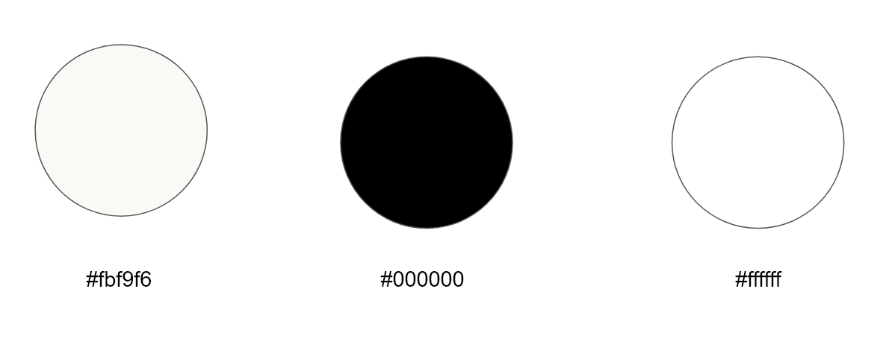

- *#fbf9f6* The subtle, parchment-like background texture subtly mirrors the tactile sensation of a physical book. It's a gentle reminder of the comforting weight of literature.

- *#000000* I chose the color black for the book club text to evoke a sense of elegance and timelessness, reminiscent of the classic ink on the pages of a well-loved book.
  
- *#ffffff* Like the margins of a book page, whitespace surrounds the content, offering a serene reading experience. It allows your eyes to rest, emphasizing the beauty of both text and images.

#### **Fonts**

I imported [Google Fonts](https://fonts.google.com/) and used [Merriweather](https://fonts.google.com/specimen/Merriweather) (with a fallback of Sans Serif) for the main body text. Typography is the soul of a book, and I carefully selected classic, readable fonts that transport you to the comforting pages of a novel.

## Technologies Used

### Languages

- HTML
  - The structure of the book club website was developed using HTML as the main language.
- CSS
  - The bookclub was styled usising custom CSS in an external file.

### Tools

- [Code Anywhere](https://codeanywhere.com/)
  - Used for writing, editing the code for the project.

- [GitHub](https://github.com/)
  - Used to store the project code after being created in Code Anywhere.

- [Balsamiq](https://balsamiq.com/)
  - I utilize Balsamiq for crafting wireframes, enabling me to visualize and iterate on the layout and design of the web pages with ease and precision.

- [Bootstrap 5.2.3](https://getbootstrap.com/)
  - Used to aid the coding of some layout elements, such as the nav bar, footer and cards. Bootstrap enabled the development of a responsive web design. Bootstrap is a free and open-source CSS framework directed at responsive, mobile-first front-end web development. It contains HTML, CSS and JavaScript-based design templates for typography, forms, buttons, navigation, and other interface components.

- [Google Fonts](https://fonts.google.com/)
  - Used to select & import the fonts to the project (Merriweather).

- [Font Awesome](https://fontawesome.com/)
  - Used to add icons to the site in order to improve UX and give it more personality.

- [Tiny Img](https://tiny-img.com/webp/)
  - Used to further optimise the images for the site and reduce file size

- [Canva](https://www.canva.com/)
  - Used to design the site logo

- [This Person Does Not Exist](https://thispersondoesnotexist.com/)
  - Used to generate images for the 'About Us' page.

- [ChatGPT](https://chat.openai.com/)
  - Used to generte general content for the webpage such as 'About the Author' section.

- [WAVE](https://wave.webaim.org/)
  - Evaluation tools that helps authors make their web content more accessible to individuals with disabilities.

## Features

### Whole Site

#### **Nav Bar**

Screenshots

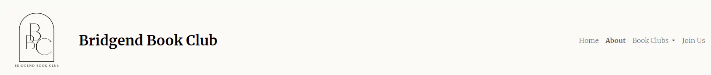

*Navbar - desktop*

*Navbar - hover effect and drop down*

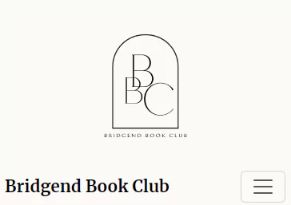

*Navbar - mobile*

- Appears on all pages.
- Contains the logo, the name of the bookclub (on larger screens) and nav links to all the main pages.
- Fully responsive.
- The page the user is presently on is highlighted.
- Hover effect on nav links.

#### **Hero**

Screenshots

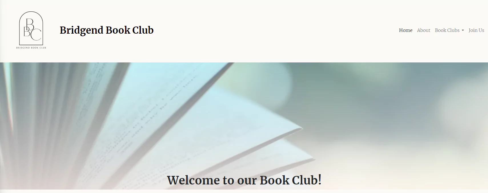

*Hero - Home on Desktop*

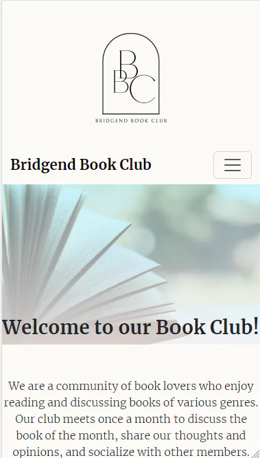

*Hero - Home on Mobile*

- Hero image included on the home page with a welcome message.
- The hero image has a gradient over it to improve the legibility of the text.
- Hero image is responsive

#### **Footer**

Screenshots

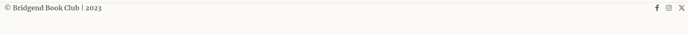

*Footer on Desktop*

*Footer Social Links Animation*

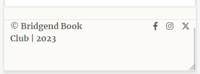

*Footer on mobile*

- The footer appears on all pages.
- The footer contains links to social media pages and make use of icons.
- All links open in a separate tab.
- The footer has a responsive design

#### **Favicon**

Screenshots

*Favicon*

- I added a favicon feature to the Bridgend Book Club logo in the top tab of the site in order to enhnce:
  
  - *Branding and Recognition:* A favicon is a small but significant branding element. It helps users quickly recognize and remember your website when they have multiple tabs open in their browser. It's like a mini logo that reinforces your brand identity.
  - *Professionalism:* Having a favicon demonstrates professionalism and attention to detail. It shows that I've invested time and effort in making your website visually appealing and user-friendly.
  - *User Experience:* When users bookmark the book club's website or add it to their browser's favorites, the favicon appears next to the website's name. This makes it easier for users to find and revisit your site.
  - *Tab Identification:* In a browser, the favicon appears in the tab's title bar. It provides a visual cue that helps users distinguish the book club's website from others when they have multiple tabs open. 
  - *Credibility:* A well-designed favicon can enhance the website's credibility and trustworthiness. It's a small but important aspect of web design that contributes to the overall user experience.
  - *Consistency:* Including a favicon is part of creating a consistent and cohesive design. It adds to the overall aesthetic and complements the design choices I've made elsewhere on the book club's website.

### Home Page

#### **Bio & Join Us Button**
<!-- Insert info here-->

### About Us

#### **About Us Sections**
<!-- Insert info here-->

#### **Call To Action**
<!-- Insert info here-->

### Book Club

#### **Book Club Options**
<!-- Insert info here regarding the different bookclubs available ie fiction-->
### Join Us

#### **Join Us Info & Form**
<!-- Insert info here-->

### Other Pages

#### **Thankyou Page**
<!-- Insert info here-->

#### **404 Page**
<!-- Insert info here-->

### Future Features
<!-- Insert info here-->

The following user goals were removed from the README due to knowledge limitations. The following future features would be introduced to address the unmet identified user goals.

- **Personalised Reading Lists:** Utilize JavaScript and Python to allow users to create personalize reading lists based on their activity on the site (i.e based on the bookclubs the user has signed up to);
- **Book Suggestions:** To allow users to post a book suggestion.Without creting another form that duplicates the same behaiour as the 'Join US' form included in this project. i.e. A form that doesn't actually POST any data to facilitate collection. JavaScript and Python knowledge will be necessary.
- **Chatrooms:** Future work would include creating a digital chatroom to provide a platform for members to engage in discussions.

## Testing & Bugs

### Bug: Custom Google font not showing

Using a custom Google Font did not show initially when targeting `html` element. This is because bootstrap defines it's own, ["native" font stack](https://getbootstrap.com/docs/5.3/content/reboot/#native-font-stack) which meant I had to override elements with a higher specificity in the CSS file. e.g. `navbar-brand`

### Bug: X-Overflow on footer

Navbar was causing x-overflow because of the gap spacing provided by boostrap by default when using `display: flex` or `display: grid` on elements.
Using the `gap-0` on the navbar element removed the gap which was causing the element to be wider than the width of the viewport.

### Bug: Page refreshing when submitting form

When clicking the "Join!" button it was only refreshing to the form page again. I wanted it to go to a thank you page.

Using [mdn web docs](https://developer.mozilla.org/en-US/docs/Web/HTML/Element/form) I found that form has an `action` attribute that can set the URL to process a form submission.

### Bug: Hero image header h1 opacity

When setting a filter to make the hero image more opaque using `filter: opacity(0.3)` it was altering the appearance of the `h1` also which made it unreadable.
*fix*: Adapting code found on a blog from LogRocket about [image overlays](https://blog.logrocket.com/guide-image-overlays-css/#using-linear-gradient-css-function) using the linear gradient method.

### Bug: Card group images not aligning

When changing the images and titles to the respective book genres they became 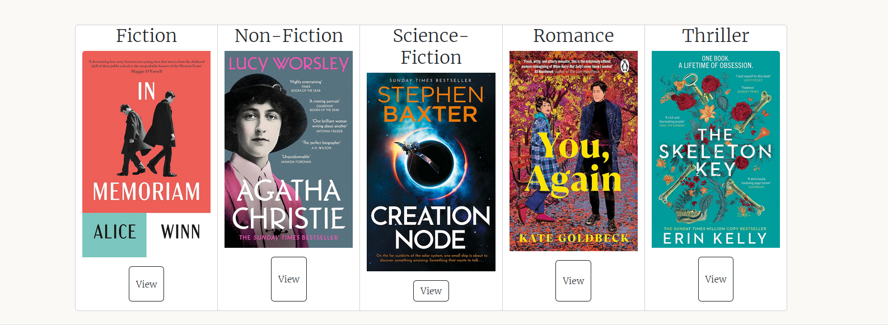.

*fix* : Making use of Boostraps `row` and `row col` classes [found used here for grid cards](https://getbootstrap.com/docs/5.3/components/card/#grid-cards).

### Bug: Footer too large when page contains minimal content

When viewing a page that contained minimal content within the main section the footer would rise far up the page giving the appearance of an .

*fix* : Making use of `flexbox` to create a sticky footer. Code was adapted from  [Philip Walton's Sticky Footer demo](https://philipwalton.github.io/solved-by-flexbox/demos/sticky-footer/).

### HTML Validation

Home

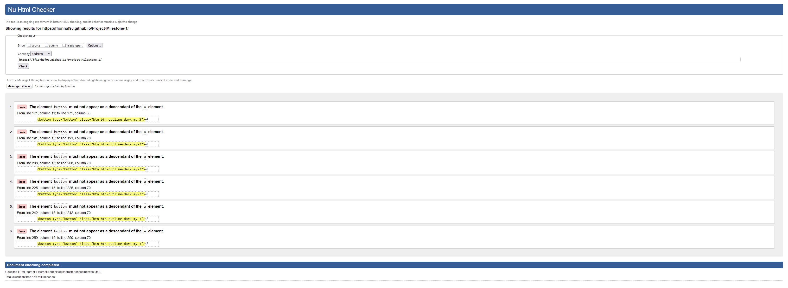

About Us

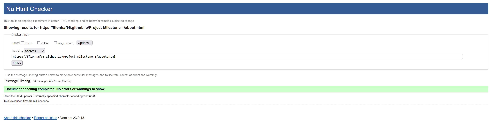

Book Clubs

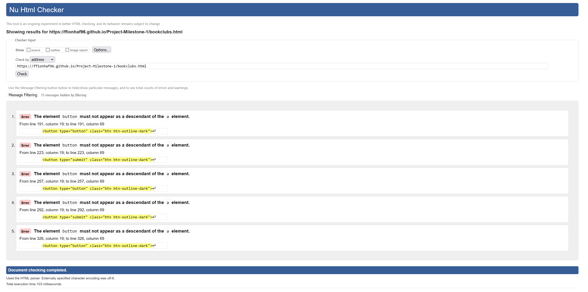

Individual Book Club Pages

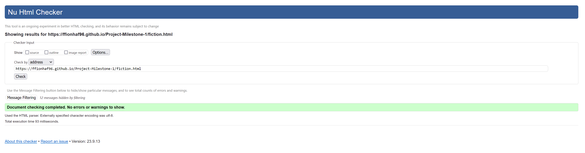

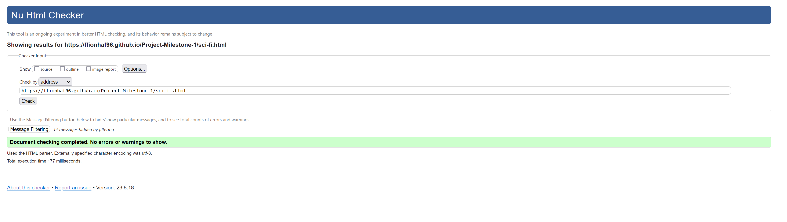
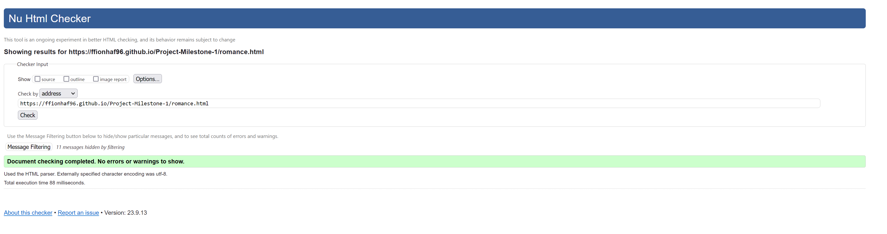
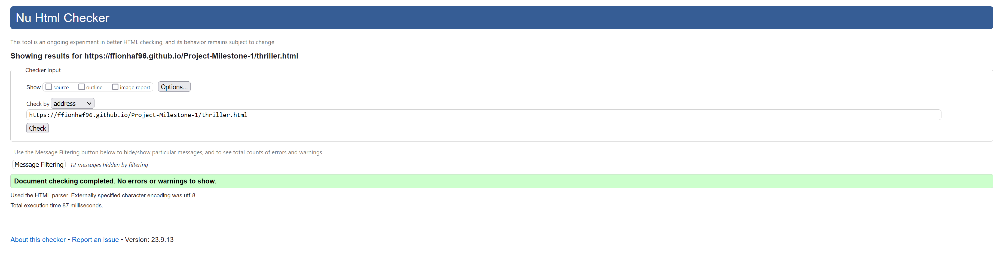

Join Us

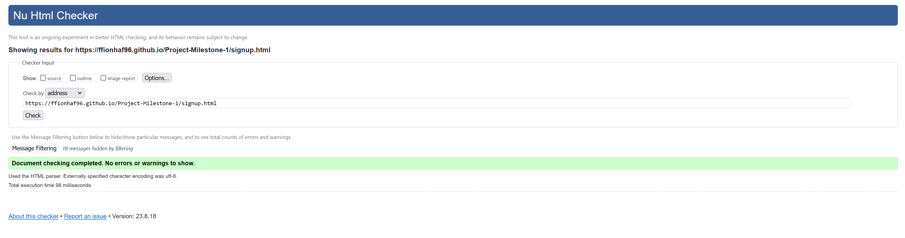

Thankyou

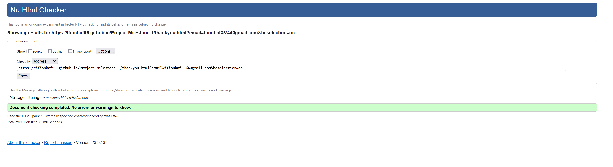

404

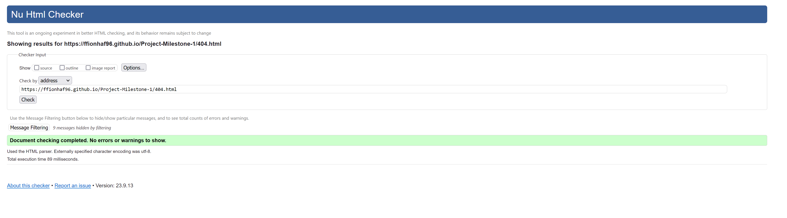

#### **Results**

2 of the pages contained errors; 'Home' and 'Book Clubs'.

#### **HTML Validation After Fixes**

Home

Book Clubs

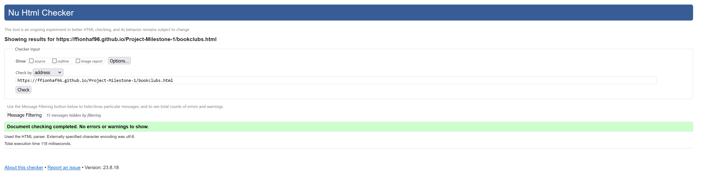

### CSS Validation

CSS Validation Results

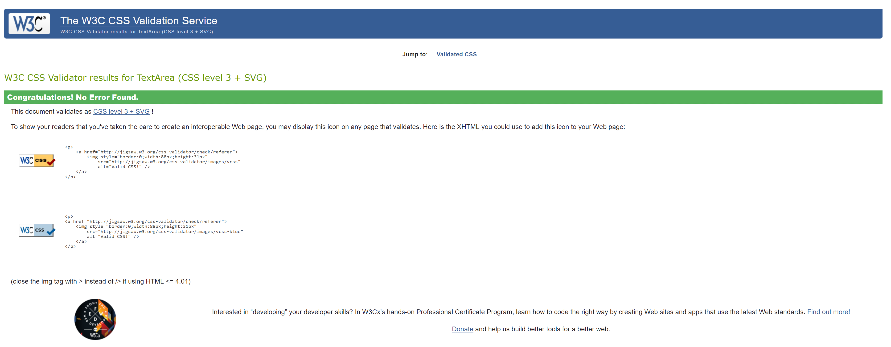

I ran the CSS code through the [W3C CSS Validator](https://jigsaw.w3.org/css-validator/#validate_by_input). No errors were found.

### Accessibility

Screenshot

    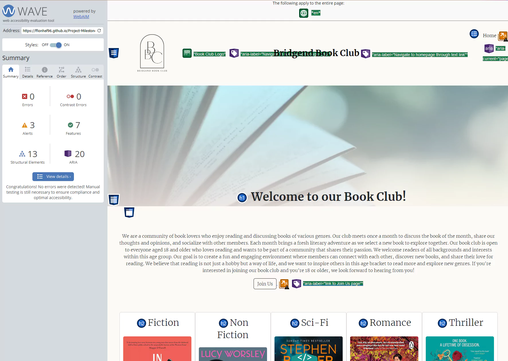
    

Ensuring the accessibility of the Bridgend Book Club website was identified as a priority. Accessibility allows all users, including those with disabilities, to access and use our content effectively. To assess the accessibility of the website I utilised the [WAVE](https://wave.webaim.org/) accessibility evaluation tool as a development tool to help identify and address accessibility issues.

A screenshot has been included to show the Home Page WAVE evalutation which indicates 0 errors, 0 contrast errors, 7 features (including alt text), 13 structural elements (including navigation, header, main content and footer) and 20 ARIA labels.

### Performance
<!-- Insert info here-->

### Responsiveness / Device Testing
<!-- Insert info here-->

### Browser Compatibility
<!-- Insert info here-->

### Testing User Stories
<!-- Insert info here-->

## Deployment
<!-- Insert info here-->

## Credits

*note*: Credit and references for bug fixes and relating issues has been given in the sub-section "Testing & Bugs".

### Code

commit 3174818: [move navbar list items to right](https://stackoverflow.com/a/70125008)

commit XXXXXXX [Responsive font-size](https://css-tricks.com/snippets/css/fluid-typography/)

#### Google Maps Embed

[Embed Map](https://www.embed-map.com/>)

### Content

Written copy provided by ChatGPT for website content including home intro, 'about us' ETC.

### Media
<!-- Insert info here-->
All imagss contained within the 'book-clubs' asset folder were taken from amazon.com
[fiction.jpg](https://m.media-amazon.com/images/I/71LpgK2QMvL._SL1500_.jpg)
[non-fiction.jpg](https://m.media-amazon.com/images/I/81e-1MaYjJL._SL1500_.jpg)
[romance.jpg](https://m.media-amazon.com/images/I/A1cHsf+YuML._SL1500_.jpg)
[science-fiction.jpg](https://m.media-amazon.com/images/I/61oivxKw6yL._SL1000_.jpg)
[thriller](https://m.media-amazon.com/images/I/81chGLxyiPL._SL1500_.jpg)

### Acknowledgements
